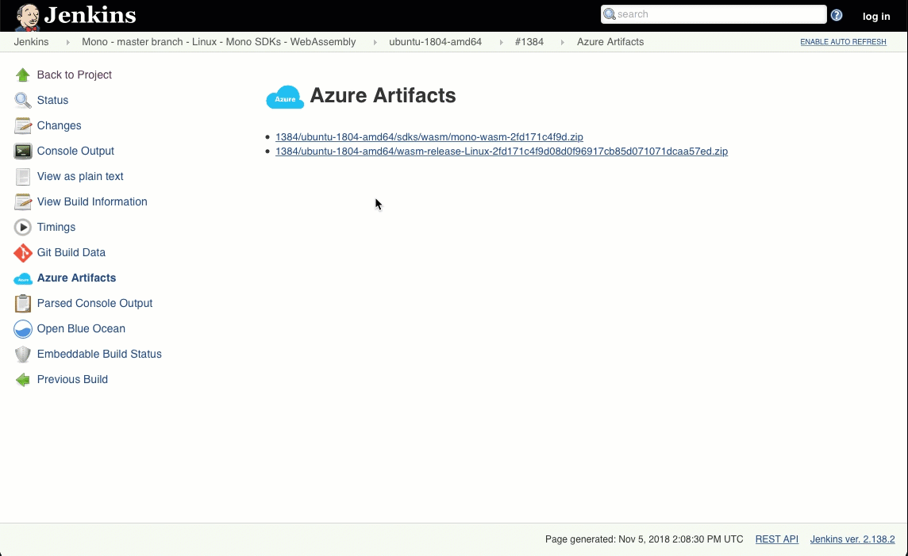

# Dolittle WebAssembly Interaction Layer

## Cloning

This repository has sub modules, clone it with:

```shell
$ git clone --recursive <repository url>
```

If you've already cloned it, you can get the submodules by doing the following:

```shell
$ git submodule update --init --recursive
```

## Building

All the build things are from a submodule.
To build, run one of the following:

Windows:

```shell
$ Build\build.cmd
```

Linux / macOS

```shell
$ Build\build.sh
```

## Visual Studio

You can open the `.sln` file in the root of the repository and just build directly.

## VSCode

From the `Build` submdoule there is also a .vscode folder that gets a symbolic link for the root. This means you can open the
root of the repository directly in Visual Studio Code and start building. There are quite a few build tasks, so click F1 and type "Run Tasks" and select the "Tasks: Run Tasks"
option and then select the build task you want to run. It is folder sensitive and will look for the nearest `.csproj` file based on the file you have open.
If it doesn't find it, it will pick the `.sln` file instead.

## Pre-requisites

If you're packaging the solution on Windows, you'll need to have [7-Zip](http://www.7-zip.org/) installed.

## Usage

To use this, you'll need to have a .NET Standard 2.0 class library project and reference the NuGet package called `Dolittle.Interaction.WebAssembly.Build`. This will build and output the necessary WebAssembly files to get you started.
It also outputs an `index.html` file.

### Output

The default output points to `./publish`, this can be changed by adding a variable to a `<PropertyGroup>` in your `.csproj` file for your project.

```xml
<PropertyGroup>
    <WasmOutput>../Web/wwwroot/wasm</WasmOutput>
</PropertyGroup>
```

This will then output all artifacts needed to run your application.

## Mono Wasm

This solution is built on top of the [Mono Wasm](https://github.com/mono/mono/tree/master/sdks/wasm) solution.
The package creation is the one responsible for packaging this project and including the necessary dependencies.
To keep this repository as lightweight as possible the Mono Wasm dependency is downloaded and included at packaging time.

### Updating the Mono Wasm reference to a greater version

To update the Mono Wasm build to a greater version - one needs to update the [Build.csproj](./Source/Build/Build.csproj).
The `DownloadFile` task points to a `SourceUrl` - this is the attribute that needs to be updated:

```xml
<DownloadFile DestinationFolder="."
              DestinationFileName="mono-wasm.zip"
              SourceUrl="https://jenkins.mono-project.com/job/test-mono-mainline-wasm/label=ubuntu-1804-amd64/lastSuccessfulBuild/Azure/processDownloadRequest/1384/ubuntu-1804-amd64/sdks/wasm/mono-wasm-2fd171c4f9d.zip"/>
```

You update it by finding the URL to for instance the last successful build artifacts from [here](https://jenkins.mono-project.com/job/test-mono-mainline-wasm/label=ubuntu-1804-amd64/lastSuccessfulBuild/Azure/).

Navigate to it and get the link:


## More details

To learn more about the projects of Dolittle and how to contribute, please go [here](https://github.com/dolittle/Home).

## Getting Started

Go to our [documentation site](http://www.dolittle.io) and learn more about the project and how to get started.
Samples can also be found [here](https://github.com/Dolittle-Samples).
You can find entropy projects [here](https://github.com/Dolittle-Entropy).
